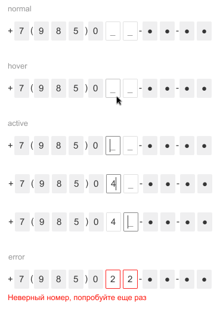
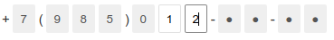

# phone-input-componet

Компонент для ввода номера телефона.

[Live Демо компонента](https://ermako27.github.io/phone-input-componet/)

## Установка

npm install --save-dev phone-input-componet

## Сборка проекта

npm run build

## Тестирование

npm run test

## Визуальные состояния компонента



## Создание компонента
Для создания компонента необходимо передавать в маску.
Маска - строка, по которой будет построен компонент, может быть произвольной длинны, не может быть пустой строкой (```''```), все пробелы из маски будут удалены, если маска состоит только из пробелов, то маска считается пустой строкой.

Так же можно, но не обязательно, передавать в виде object изначальное состояние компонента.

**Значение элементов маски:**
 * "I" - одиночный инпут для ввода одной цифры
 * "X" - серый блок с символом "X"
 * "*" - серый блок с символом "●"
 * <цифра> - серый блок с введенной цифрой
 * <не цифра> - символ отображается "как есть"
 */

**Пример создание компонента**
```javascript
import PhoneComponent from 'phone-input-componet';
import 'phone-input-componet/styles/styles.min.css';

// маска
const mask = '+7(985)0II-**-**';

// Создание компонента в состоянии normal
const first = new PhoneComponent(mask)

// Создание компонента в состоянии error
const second = new PhoneComponent(mask, {error: true})
```

## Api компонента

Api предоставляет 3 метода для управления компонентом
* ```constructor(mask: string, state: PhoneComponentState = {error: false})```
* ```createComponent()```
* ```getComponentValue()```
* ```setState({error = false})```

## Описание методов

### **constructor(mask, state = {error: false})**

Метод срабатывающий при создании компонента
Аргументы:

* mask: тип string - маска, по которой будет строиться компонент
* state: тип object - изначальное состояние компонента, значение по умолчанию ```{error: false}```

### **createComponent()**
Метод для создания компонента, компонент представляет собой HTMLElement

### **getComponentValue()**
Метод предназначенный для получения введенного номера телефона. При помощи этого метода возможно извлечь номер телефона из компонента в обоих его состояних, как в нормальном так и в ошибочном.

Формат возвращаемого значение

**Все доступные для ввода части компонента заполнены**



```
{
    maskNumber: '+7(985)012-**-**'
    rawNumber: '12'
}
```

**Все доступные для ввода части компонента пусты**


```
{
    maskNumber: '+7(985)0II-**-**'
    rawNumber: ''
}
```

**Только часть доступных для ввода частей компонента заполнены**


```
{
    maskNumber: '+7(985)0I8-**-**'
    rawNumber: '8'
}
```

### **setState({error = false})**
Метод предназначен для изменения визуального состояния компонента.

Аргумент: тип object, значение по умолчанию {error = false}

**ВАЖНО: не используйте данный метод до выполнения createComponent() и попадания компонента в DOM**

## Пример использования компонента

```javascript
import PhoneComponent from 'phone-input-componet';
import 'phone-input-componet/styles/styles.min.css';


let toggler = true;
const mask = '+7(985)0II-**-**';

// Создаем компонент
const phoneComponent = new PhoneComponent(mask);

const form = document.createElement('form');

const submitButtonDiv = document.createElement('div');
const submitButton = document.createElement('button');
submitButton.type = 'submit';
submitButton.innerText = 'Отправить';
submitButtonDiv.appendChild(submitButton);

// Добавляем к форме компонент
form.appendChild(phoneComponent.createComponent());
form.appendChild(submitButtonDiv);

// пользовательский callback, использующий методы компонента
form.onsubmit = event => {
    event.preventDefault();
    phoneComponent.setState({error: toggler});
    console.log(phoneComponent.getComponentValue());
    toggler = !toggler;
};

const root = document.getElementById('root');
root.appendChild(form);

```